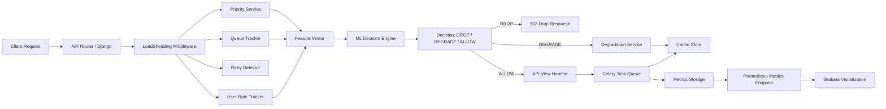

# Load Shedder

## Overview

Load Shedder is a Django-based request management system designed to protect web services during high traffic and overload conditions. It uses a combination of real-time request scoring, retry detection, queue tracking, cache-based degradation, Celery background tasks, and an ML-based decision engine to determine whether incoming requests should be allowed, degraded, or dropped.

This repository implements:

- Load shedding middleware for request admission control
- Priority classification based on user role and request type
- Real-time rate tracking and queue length monitoring
- Retry detection to reject abusive repeated requests
- Degraded fallback responses for low-priority endpoints
- Prometheus-compatible metrics reporting
- Celery tasks for asynchronous cache updates, metric logging, and model retraining
- A Random Forest model to make overload decisions using operational features

## Architecture



### Architecture Workflow

1. A request enters the system through the Django API router (`config/urls.py` → `core/urls.py`).
2. `LoadSheddingMiddleware` intercepts the request before view execution.
3. The middleware increments the in-flight queue counter and gathers current state:
   - `core.utils.queue_tracker.get_queue_length()`
   - `core.utils.rate_tracker.track_request(user_key)`
   - `core.utils.retry_tracker.is_retry(request)`
4. If the request is detected as a retry, the middleware immediately returns a `429` retry response.
5. The priority service evaluates the request based on:
   - user type (`premium`, `normal`, `anonymous`)
   - request type (`payment`, `search`, `recommendation`, or default)
6. The feature vector is passed to the ML scoring service, which loads a pre-trained Random Forest model and returns one of the overload decisions.
7. The middleware logs metrics asynchronously through Celery and updates Prometheus gauges and counters.
8. Based on the decision:
   - `DROP` returns a `503` response immediately
   - `DEGRADE` returns a cache-backed fallback response or a simplified error for payment requests
   - `ALLOW` forwards the request to the normal Django view handler
9. Normal responses may still trigger background cache updates via `core.tasks.update_cache_task`.

## Features

### Load Shedding Middleware

- Centralizes admission control in `core/middleware/load_shedding.py`
- Uses queue tracking, rate tracking, and retry detection
- Ensures the system can degrade gracefully as load increases
- Supports per-request decisioning based on current system state

### Priority Service

- Encodes user priority and request importance in `core/services/priority.py`
- Assigns higher weight to premium users and critical requests like `payment`
- Generates a composite `priority_score` used by the ML model

### Retry Detection

- Detects repeated identical requests using a fingerprint in `core/utils/retry_tracker.py`
- Limits retries within a short window to avoid amplification storms
- Returns `429 Too Many Retries` when abuse is identified

### Degradation Service

- Provides degraded fallback responses in `core/services/degradation.py`
- Uses cached search and recommendation responses when available
- Returns simplified error messaging for non-cacheable payment requests
- Preserves service continuity for best-effort endpoints

### Metrics and Observability

- Exposes Prometheus-compatible metrics at `/api/metrics/`
- Tracks request decisions with Prometheus counters and gauges
- Records queue length and per-user request rate
- Logs metric events asynchronously via `core.tasks.log_metrics_task`

### Background Tasks (Celery)

- `update_cache_task`: writes response data into the cache store asynchronously
- `log_metrics_task`: appends real-time metrics with timestamps
- `retrain_model_task`: retrains the ML model when enough metric data is available
- Uses `config/celery.py` to configure the Celery app for Django integration

## API Endpoints

All endpoints are exposed under `/api/` in `config/urls.py`.

### `GET /api/recommend`

- Returns a recommendation payload
- Example response:
  ```json
  {
    "data": [
      {"id": 1, "name": "Laptop"},
      {"id": 2, "name": "Phone"}
    ],
    "source": "live"
  }
  ```
- Under high load, the middleware may degrade the response using cached recommendations

### `GET /api/search/?q=<query>`

- Returns a search-style payload for the provided query
- Example response:
  ```json
  {
    "data": [
      {"id": 101, "title": "Result for example"}],
    "source": "live"
  }
  ```
- Under degradation, the request is served from cache if present

### `GET /api/metrics/`

- Returns Prometheus metrics in plaintext format
- Suitable for scraping by Prometheus and Grafana
- Provides insights for request decision counts, queue length, and user rates

## Machine Learning Model

The decision engine uses a Random Forest classifier to predict whether requests should be dropped, degraded, or allowed.

### Model Input Features

- `user_rate`: requests from the same user in the last 60 seconds
- `queue_length`: number of concurrently active requests
- `priority_score`: combined score from user importance and request type

### Why Random Forest?

- Robust to noisy or non-linear relationships between load and decision state
- Handles small-to-medium-sized feature sets without heavy hyperparameter tuning
- Provides a stable decision boundary for operational workload classification
- Well-suited for a system where request behavior and priority signals interact

### Training Pipeline

- Training data is read from `core/ml/training_data.csv`
- The model is trained in `core/ml/train_model.py`
- The resulting model artifact is stored as `core/ml/model.pkl`
- Retraining can be triggered via `core/tasks.py` using the Celery task `retrain_model_task`

### Decision Flow

- `core/services/scoring.py` calls `core.ml.model.predict()`
- The loaded model returns a decision label such as `DROP` or `DEGRADE`
- The middleware interprets the label and applies the appropriate admission policy

## Deployment Notes

- Django application entrypoint is `manage.py`
- Application URLs are configured in `config/urls.py`
- Celery is configured in `config/celery.py`
- Prometheus scraping is supported through `/api/metrics/`

## Dependencies

Key Python dependencies in this project include:

- Django
- Celery
- prometheus_client
- scikit-learn
- pandas
- joblib

> Note: The repository also includes a `requirements.txt` file with package version pins.

<!-- ## Grafana Dashboard Placeholder

A Grafana dashboard can be built from the Prometheus metrics emitted by the application.

### Dashboard Screenshots

- **Grafana Dashboard 1**: Request decision distribution
- **Grafana Dashboard 2**: Queue length and ingestion rate over time
- **Grafana Dashboard 3**: Per-user rate and retry behavior

> Add Grafana dashboard screenshots here once available.

## Adding Grafana Images

```markdown
### Grafana Dashboards


``` -->

## Future Enhancements

- Add authenticated user support for more advanced priority tiers
- Replace the in-memory queue and retry trackers with Redis for cluster safety
- Expand the ML feature set with endpoint semantics and historical latency
- Add real Grafana dashboards and screenshots to the documentation

## Contact

For questions about this implementation, inspect the middleware and model files under `core/` and the Celery configuration in `config/celery.py`.
